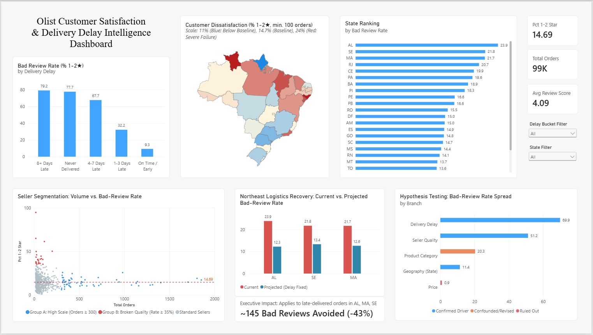

# Olist E-Commerce Case Study: Root-Cause Analysis of Customer Dissatisfaction


---

## Executive Summary
Olist, a Brazilian e-commerce marketplace connecting independent merchants to major retail platforms, experienced recurring customer dissatisfaction. This case study diagnoses **what actually drives low review scores (1–2★) — delivery delay, price, product category, seller quality, or geography — and quantifies the highest-ROI operational fix.**

> **Headline Payoff:** Closing the delivery-delay gap in the three worst-performing Northeast states (Alagoas, Maranhão, and Sergipe) to match the platform's on-time baseline is estimated to eliminate **~145 bad reviews (~43% reduction in 1–2★ reviews across these states)** without requiring catalog or pricing changes.

---

## Interactive Dashboard
The complete analysis is synthesized into an executive intelligence dashboard in **Power BI** (and **Tableau Public**):



* **Power BI File:** [`dashboard/olist_ecommerce_powerbi_dashboard.pbix`](dashboard/olist_ecommerce_powerbi_dashboard.pbix) *(Screenshot above)*
* **Tableau Public:** *[Link to be attached upon publication]*

---

## Data & Architecture
* **Dataset:** Real, anonymized transactional data from Olist ([Kaggle: `olistbr/brazilian-ecommerce`](https://www.kaggle.com/datasets/olistbr/brazilian-ecommerce)) covering ~99,000 orders placed between 2016–2018 across customers, orders, items, products, sellers, payments, and reviews.
* **Data Engineering:** Staged loose raw CSVs in a dedicated staging schema, validated for key uniqueness, orphan records, missing values, impossible date sequences, and range constraints, then transformed into a typed, highly constrained PostgreSQL production schema (detailed in [`DECISIONS.md`](DECISIONS.md)).

---

## Analytical Methodology
1. **Baseline Scorecard:** Established the platform-wide baseline (average review score of **4.09/5.00**, with **14.69%** of orders receiving 1–2★ reviews) as the benchmark for all subsequent testing.
2. **Issue-Tree Analysis (SQL):** Formulated a MECE root-cause tree and tested five potential drivers in isolation:
   * *Branch 1:* Delivery Delay (order duration & estimation error)
   * *Branch 2:* Price (relative-to-category and absolute quartiles)
   * *Branch 3:* Product Category (high-volume category comparisons)
   * *Branch 4:* Seller Quality (volume vs. rate-based segmentation)
   * *Branch 5:* Geography (state-level delay & review distributions with Haversine distance cross-check)
3. **Multivariable Regression (Python / statsmodels):** Estimated an OLS regression model on 86,756 single-item orders (`review_score ~ delay_days + price + seller_avg_score + product_category + customer_state`, $R^2 = 0.152$) to test which branches survive simultaneous controls.
4. **Opportunity Sizing (Decision Modeling):** Sized the impact of resolving the carrier delay gap in the worst-performing states using empirical delay-bucket counterfactual rates.
5. **BI Dashboarding:** Designed a decision-support dashboard in Power BI displaying KPIs, the delay cliff effect, geographic heatmaps, seller segmentation, and hypothesis verdicts.

---

## Core Findings

| Branch | Verdict | Key Evidence |
|:---|:---:|:---|
| **Delivery Delay** | ✅ **Confirmed Root Cause** | Bad-review rate climbs from **9.28%** (on-time) to **79.16%** (8+ days late) — a steep cliff effect rather than a gradual decline. Highly significant in regression (coef `-0.0349`/day, $p < 0.001$). Delay-related causes account for **42.72%** of all bad reviews. |
| **Seller Quality** | ✅ **Confirmed Root Cause** | The worst 10% of sellers generate **~73%** of all bad reviews on the platform. A separate rate-based screen exposes structurally broken sellers (**34%–65%** bad-review rates) invisible in raw volume views. Dominates the regression model (coef `+0.896`, $p < 0.001$). |
| **Geography** | ✅ **Confirmed Root Cause** | Northeast states (AL, MA, SE, CE, PI) suffer **13%–21%** late rates and **18%–24%** bad-review rates (vs. ~4% and ~13% in the Southeast: SP, PR, MG). Haversine distance cross-check proves physical distance does **not** explain this (remote Amazon states perform well; nearby RJ underperforms), confirming a genuine regional carrier/logistics gap. |
| **Product Category** | ⚠️ **Confounded (Not Independent)** | Appeared meaningful in isolation (7.89%–26.08% bad-review rate spread), but nearly all category dummies lose statistical significance ($p > 0.05$) once seller quality and region are controlled for. Category underperformance was primarily confounded by worse sellers and regional carrier bottlenecks. |
| **Price** | ❌ **Ruled Out** | Review distributions are virtually flat across both relative and absolute price quartiles (15.9%–16.8% bad rate across all tiers). Statistically non-zero in regression solely due to large $N$, but practically negligible (a ₹1,000 price increase shifts predicted score by only ~0.067 stars). |

*For complete SQL queries and intermediate findings, see [`FINDINGS.md`](FINDINGS.md).*

---

## Strategic Recommendations

### Priority 1: Regional Carrier Renegotiation (Northeast Focus)
* **Action:** Audit and renegotiate service level agreements (SLAs) with regional carriers in **Alagoas (AL)**, **Maranhão (MA)**, and **Sergipe (SE)** to eliminate last-mile delays.
* **Projected Impact:** Closing the delivery delay gap to match platform on-time efficiency eliminates an estimated **~145 bad reviews (~43% of all 1–2★ reviews across these three states)**, bringing state dissatisfaction rates from ~22.3% down to ~12.7% (below the platform baseline).
* *Scope Caveat:* Sizing strictly covers late-but-delivered orders; complete non-delivery failures (`never_delivered`: 16 in AL, 30 in MA, 15 in SE = 61 orders) represent lost packages/cancellations requiring separate inventory and carrier accountability protocols.

### Priority 2: Two-Pronged Seller Quality Governance
* **High-Volume Sellers:** Audit large merchants who maintain "acceptable" bad-review rates (~14%) but contribute heavy absolute complaint volume due to sheer scale. Operational coaching here yields massive absolute customer retention.
* **Low/Mid-Volume Problem Sellers:** Implement a mandatory rate-based screen flagging sellers with bad-review rates $\ge 35\%–40\%$ (min. 20 orders). These sellers are invisible to raw complaint leaderboards but cause catastrophic customer churn.

### Not Recommended:
* **Category or Pricing Interventions:** Do not alter product margins or penalize bulky categories (e.g. office furniture) under the assumption that price or category drives dissatisfaction. Phase 4 proved these are symptoms of seller and logistics confounding, not root causes.

---

## Repository Structure

```text
Olist/
├── analysis/         # Baseline metrics, 5 SQL branches, regression dataset, & opportunity sizing
│   ├── 01_baseline_metrics.sql
│   ├── 02_branch1_delivery_delay.sql
│   ├── 03_branch2_price.sql
│   ├── 04_branch3_product_category.sql
│   ├── 05_branch4_seller.sql
│   ├── 06_branch5_geography.sql
│   ├── 07_regression_dataset.sql
│   ├── 08_regression.ipynb
│   └── 09_opportunity_sizing.sql
├── dashboard/        # Power BI (.pbix) model and exported dashboard preview
│   ├── olist_ecommerce_powerbi_dashboard.pbix
│   └── olist_ecommerce_powerbi_dashboard.png
├── data/raw/         # Raw CSV files (git-ignored, available via Kaggle)
├── sql/              # Staging schema, load scripts, data quality checks, & DDL transforms
│   ├── 01_staging_schema.sql
│   ├── 02_load_staging.sql
│   ├── 03_validation_checks.sql
│   ├── 04_public_schema.sql
│   └── 05_transform_load.sql
├── DECISIONS.md      # Data engineering logs, schema rationale, & anomaly resolution
├── FINDINGS.md       # Detailed empirical findings log across all 5 branches & regression
└── README.md         # Executive case study documentation (this file)
```

---

## Reproduction Setup
1. **Obtain Data:** Download the dataset from Kaggle: [Brazilian E-Commerce Public Dataset by Olist](https://www.kaggle.com/datasets/olistbr/brazilian-ecommerce) and extract into `data/raw/`.
2. **Database Initialization:** Execute SQL scripts sequentially in PostgreSQL:
   ```bash
   01_staging_schema.sql -> 02_load_staging.sql -> 03_validation_checks.sql -> 04_public_schema.sql -> 05_transform_load.sql
   ```
   *(Update local CSV paths in `02_load_staging.sql` as needed).*
3. **Exploratory Branches:** Execute scripts `01_` through `06_` and `09_` in `analysis/`.
4. **Regression Model:** Run `analysis/08_regression.ipynb` using Python 3.x (`pip install pandas statsmodels python-dotenv sqlalchemy psycopg2-binary`).

---

## Methodological Limitations
* **Multicollinearity:** Elevated condition number ($5.1 \times 10^4$) was observed in the regression model due to natural geographic clustering between merchants and product categories. While category significance was absorbed by seller and regional effects, category coefficients should be interpreted as "not independently explanatory" rather than definitively irrelevant.
* **Unobserved Physical Variables:** Detailed product condition (e.g. transit damage, packaging integrity, customer support transcripts) is unrecorded in the dataset, which likely accounts for the portion of seller dissatisfaction unrelated to shipping duration.
* **Target Feature Construction:** `seller_avg_score` was computed across available review history for exploratory compression; its coefficient indicates dominant directional importance rather than an isolated marginal effect.
